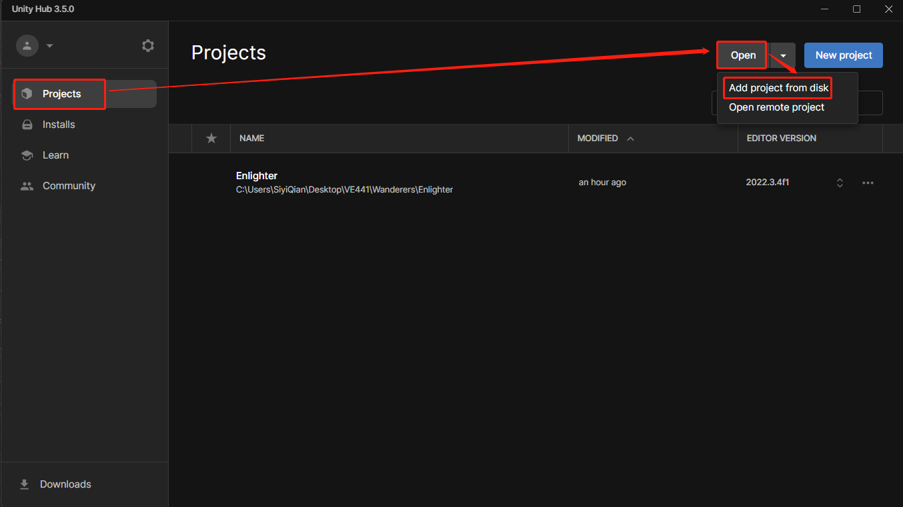
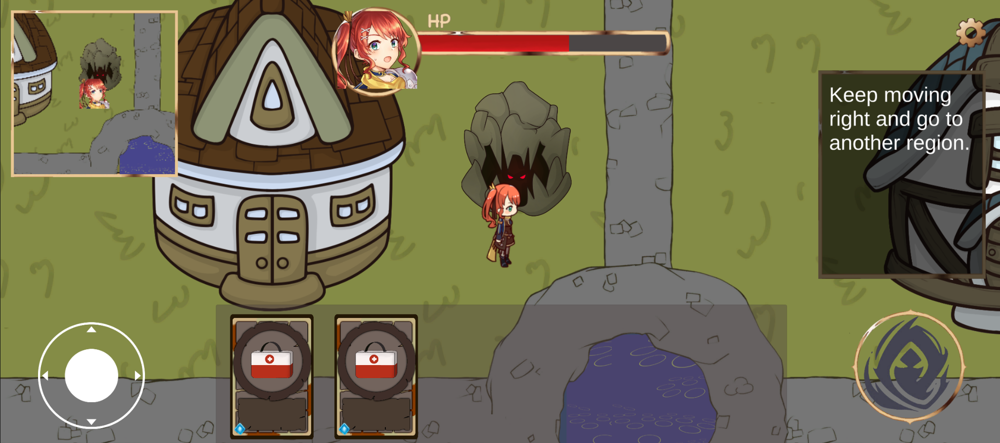

# Enlighter

# Getting Started
We use `Unity Hub` and `Unity 2022.3.4f1` to develop our game.

Download Unity LTS Release version 2022.3.4f1 from https://unity.com/releases/editor/qa/lts-releases. This will automatically download Unity Hub for you. Remember to check you have included the Android Build Support platform while installing.

Open Unity Hub, in the Project panel, click the small arrow beside the `Open` button in the top right corner and choose `Add project from disk`. Then choose the file of our project and click `Add Project` in the bottom right corner. Wait for Unity to complete setup and you can see Unity opening our project.



You can directly play our game in the unity editor by clicking the `play` button right below the top bar.

If you want to build an .exe file to play this game on `Windows`, `Mac`, or `Linux`, click `file` -> `Build Settings` -> `Build` and choose where you want to put your file.


If you want to build and play on your phone, for `Android`, switch platform from `Windows` to `Android`, click build, and choose file path.

For `iOS`, switch platform from `Windows` to `iOS`, click build, and choose file path.


# Model and Engine
## story map


## engine architecture

# In Game

### Card handler

- Stores the list of cards collection
- Fetches the information of one card
- processes the chartlets and images of the given card

### Deck handler

- Handles the card deck so as to ensure only one card is selected
- Checks the player is in a right condition when releasing a card
- Calculates and settles account of a selected card with regard to the information from the card handler

### Player handler

- Records the player's health, card list, various status, currency and location
- Connects to the UI elements to ensure displaying correctly
- Handles the player's health, status (speed up/down, invincible), currency, movement (speed and location) and animation while changes happen
- Fetches user info and character info from the host 

### Skill handler

- Controls the cooldown and effect of the skill
- Checks the player is in a right condition when releasing the skill

### Loot handler

- Randomly generates loots on the map
- Changes the player's deck while collecting the loot

### Shop Controller

- Randomly generates three cards for players to purchase 
- Controls purchasing system
- connects with player's currency

### Region Controller

- Randomly shuts down regions when the regulated time is coming
- Produces damage to the player if one is still in such region

### Minimap

- Shows the location of player on the entire map

### Rank handler

- Records the rank of the player given the time of death (1st if never fails)

# Rooms Related

### User info handler

- Uploads username to the host for the game scene to fetch
- Checks no prior redundant username is given

### Room info handler

- Generates a list of player in the same room
- Creates a room in terms of a serial number if not even exists
- Player joins a room if already exists

### Character info handler

- Records which character the player has chosen for later uses

# Result & Rankings

### Result handler

- Produces the result given rank in the game part


# APIs and Controller

### Endpoint
##### `GET /players/{playerId}/cards`

Retrieves the cards held by a specific player.

**Path Parameters**

| Parameter  | Type   | Description                       |
| ---------- | ------ | --------------------------------- |
| `playerId` | string | The unique identifier of a player |

**Response Codes**

| Code                      | Description              |
| ------------------------- | ------------------------ |
| `200 OK`                  | Success                  |
| `400 Bad Request`         | Invalid parameters       |
| `503 Service Unavailable` | Server fails to get data |

**Response**

```json
{
  "playerId": "string",
  "cards": [
    {
      "id": "string",
      "rank": "string",
      "category": "string",
      "visible": boolean,
      "inUse": boolean
    },
    ...
  ]
}
```

- `playerId` (string): The unique identifier of the player.
- `cards `(array): An array of card objects representing the cards held by the player.
  - `id` (string): The unique identifier of the card.
  - `category` (string): The category of the card (e.g., "regular", "profession", "character").
  - `rank` (string): The rank of the card (e.g., "white", "blue", "orange").
  - `visible` (boolean): Indicates whether the card is visible to other players.
  - `inUse`(boolean): Whether the card is in use.

### Endpoint
##### `GET /cards/{cardID}`

Retrieves detailed information about a specific card.

**Path Parameters**

| Parameter | Type   | Description                      |
| --------- | ------ | -------------------------------- |
| `cardId`  | string | The unique identifier of a card. |

**Response Codes**

| Code                      | Description              |
| ------------------------- | ------------------------ |
| `200 OK`                  | Success                  |
| `400 Bad Request`         | Invalid parameters       |
| `503 Service Unavailable` | Server fails to get data |

**Response**

```json
{
  "id": "string",
  "rank": "string",
  "category": "string",
  "visible": boolean,
  "inUse": boolean
}

```

- `playerId` (string): The unique identifier of the player.
- `cards `(array): An array of card objects representing the cards held by the player.
  - `id` (string): The unique identifier of the card.
  - `category` (string): The category of the card (e.g., "regular", "profession", "character").
  - `rank` (string): The rank of the card (e.g., "white", "blue", "orange").
  - `visible` (boolean): Indicates whether the card is visible to other players.
  - `inUse`(boolean): Whether the card is in use.

### Endpoint
##### `POST /players/{playerID}/changes`

Posts changes to a targeted character.

**Path Parameters**

| Parameter  | Type   | Description                          |
| ---------- | ------ | ------------------------------------ |
| `playerID` | string | The unique identifier of the player. |

**Request Body**

```json
{
    "effects":[
    {
        "attribute": "string",
        "magnitude": int,
        "duration": int
    },
    ...
  ]     
}
```

- `effect`(array): indicates the changing effects of the certain player
  - `attribute`: the changing attribute's name
  - `magnitude`: the changing magnitude
  - `duration`: the lasting time of the change. "-1" if permanent

**Response**

```json
{
  "message": "success"
}
```

- `message` (string): A success message indicating that the changes were applied successfully.


**Request Parameters**

### Endpoint: 
##### `GET /get_other_location`

**Request Parameters**

| Key  | Type   | Description        |
| ---- | ------ | ------------------ |
| `id` | string | UUID of the player |

**Response Codes**

| Code                      | Description              |
| ------------------------- | ------------------------ |
| `200 OK`                  | Success                  |
| `400 Bad Request`         | Invalid parameters       |
| `503 Service Unavailable` | Server fails to get data |

**Returns**

| Key         | Type         | Description                      |
| ----------- | ------------ | -------------------------------- |
| `locations` | list of JSON | A list of all players' locations |

Each JSON in `locations` has a structure of:

| Key  | Type   | Description                           |
| ---- | ------ | ------------------------------------- |
| `id` | string | UUID of the player                    |
| `x`  | float  | X coordinate of the player's location |
| `y`  | float  | Y coordinate of the player's location |

### Endpoint: 
##### `POST /update_self_location`

**Request Body**

| Key  | Type   | Description                           |
| ---- | ------ | ------------------------------------- |
| `id` | string | UUID of the player                    |
| `x`  | float  | X coordinate of the player's location |
| `y`  | float  | Y coordinate of the player's location |

**Response Codes**

| Code                      | Description                 |
| ------------------------- | --------------------------- |
| `200 OK`                  | Success                     |
| `400 Bad Request`         | Invalid body or method      |
| `503 Service Unavailable` | Server fails to update data |

**Returns**

If not with HTTP code 200:

| Key      | Type   | Description   |
| -------- | ------ | ------------- |
| `reason` | string | Error message |

### Endpoint: 
##### `GET /get_trading_resource`

**Request Parameters**

| Key  | Type   | Description        |
| ---- | ------ | ------------------ |
| `id` | string | UUID of the player |

**Response Codes**

| Code                      | Description              |
| ------------------------- | ------------------------ |
| `200 OK`                  | Success                  |
| `400 Bad Request`         | Invalid parameters       |
| `503 Service Unavailable` | Server fails to get data |

**Returns**

| Key         | Type         | Description                      |
| ----------- | ------------ | -------------------------------- |
| `resources` | list of JSON | A list of shops' resources/cards |

Each JSON in `resources` has a structure of:
	the same as card 

| Key           | Type   | Description                                                  |
| ------------- | ------ | ------------------------------------------------------------ |
| `id`          | string | identify of the card                                         |
| `rank`        | string | the rank of the card ("white", "blue", or "orange")          |
| `category`    | string | the category of the card ("general", "professional", or "character") |
| `selected`    | bool   | whether the card is bought and locked by other players       |
| `price`       | int    | the price of the card                                        |
| `description` | string | detailed information about a specific card                   |
| `imageurl`    | string | picture url of the card                                      |

### Endpoint: 
##### `POST /buy_cards`

**Request Body**

| Key        | Type   | Description                           |
| ---------- | ------ | ------------------------------------- |
| `playerId` | string | UUID of the player                    |
| `cardId`   | string | identify of the card that user bought |
| `money`    | int    | the amount of money user have         |

**Response Codes**

| Code                      | Description                 |
| ------------------------- | --------------------------- |
| `200 OK`                  | Success                     |
| `400 Bad Request`         | Invalid body or method      |
| `503 Service Unavailable` | Server fails to update data |

**Returns**

If not with HTTP code 200:

| Key      | Type   | Description   |
| -------- | ------ | ------------- |
| `reason` | string | Error message |

### Endpoint
##### `GET /MapStatus`

**Request Parameters**

| Parameter        | Type   | Description                              |
| ---------------- | ------ | ---------------------------------------- |
| `PlayerLocation` | vector | The coordinates of the player's location |

**Response Codes**

| Code                      | Description              |
| ------------------------- | ------------------------ |
| `200 OK`                  | Success                  |
| `400 Bad Request`         | Invalid parameters       |
| `503 Service Unavailable` | Server fails to get data |

**Returns**

| Key   | Type         | Description                                               |
| ----- | ------------ | --------------------------------------------------------- |
| Cards | list of JSON | A list of all cards at a certain distance from the player |

Each JSON in `Cards` has a structure of:

| Key       | Type   | Description                                                  |
| --------- | ------ | ------------------------------------------------------------ |
| id        | string | identify of the card                                         |
| rank      | string | the rank of the card ("white", "blue", or "orange")          |
| category  | string | the category of the card ("general", "professional", or "character") |
| location  | vector | the coordinates of the card                                  |
| usability | bool   | whether the card can be seen and picked up                   |

### Endpoint
##### `POST /UpdateMapStatus`

**Request Body**

| Key       | Type   | Description                                |
| --------- | ------ | ------------------------------------------ |
| id        | string | identify of the card                       |
| location  | vector | the coordinates of the card                |
| usability | bool   | whether the card can be seen and picked up |

**Response Codes**

| Code                      | Description              |
| ------------------------- | ------------------------ |
| `200 OK`                  | Success                  |
| `400 Bad Request`         | Invalid parameters       |
| `503 Service Unavailable` | Server fails to get data |

### Endpoint
##### `GET /MapResources`

Retrieves detailed information about a specific card reached by the player.

**Path Parameters**

| Parameter   | Type | Description                                                  |
| ----------- | ---- | ------------------------------------------------------------ |
| `cardIndex` | int  | The index of the card reached by the player among map resources. |

**Response Codes**

| Code                      | Description              |
| ------------------------- | ------------------------ |
| `200 OK`                  | Success                  |
| `400 Bad Request`         | Invalid parameters       |
| `503 Service Unavailable` | Server fails to get data |

**Response**

```json
{
  "cardIndex": "int",
  "cardInfo": {
      "id": "string",
      "rank": "string",
      "category": "string",
      "visible": boolean,
      ...
    }
}
```

- `cardInfo `(list): An list that shows attributes of the card reached by the player.
  - `id` (string): The unique identifier of the card.
  - `rank` (string): The rank of the card (e.g., "white", "blue", "orange").
  - `category` (string): The category of the card (e.g., "regular", "profession", "character").
  - `visible` (boolean): Indicates whether the card is visible to other players.

### Endpoint
##### `GET /players/{playerId}/CharacterStatus`

**Path Parameters**

| Parameter  | Type   | Description                       |
| ---------- | ------ | --------------------------------- |
| `playerId` | string | The unique identifier of a player |

**Response Codes**

| Code                      | Description              |
| ------------------------- | ------------------------ |
| `200 OK`                  | Success                  |
| `400 Bad Request`         | Invalid parameters       |
| `503 Service Unavailable` | Server fails to get data |

**Response**

```json
{
  "playerId": "string",
  "characterStatus": {
      "role": "string",
      "health": "int",
      "shield": "int",
      "cardsNum": "int",
      "speed": "float",
      "visible": boolean,
      ...
    },
}
```

- `playerId` (string): The unique identifier of the player.
- `characterStatus `(list): An list of attributes representing the status of the requested player.
  - `role` (string): The role of the player.
  - `health` (int): The HP of the player.
  - `shield` (int): The shield of the player.
  - `cardsNum` (int): The number of cards that the player have.
  - `speed` (float): The speed of the player.
  - `visible` (boolean): Indicates whether the card is visible to other players.

## Third-Party SDKs

None

# View UI/UX

### Main Menu
Play button is the entry for players who want to start a new game. Tutorial button is designed for beginners as guidance.

First you can choose your character.

Then host a game or join a game.


Only the room owner can start the game. Start the game when all players enter the room.

This is the UI after entering the game. The health bar is on the top the screen so that players can monitor their status easily. You can walk around, collect loot and attack other enemies like in the tutorial demonstrated in the next section.

Since there is limited resources available (will be refreshed frequently), you can find the merchant can buy the cards you want.


After some time, regions will be shut down gradually. Staying in the shut down region will end up in great amount of constant health decrease.

You can use the cards collected or bought from the merchant to heal yourself.


If you die or live till the end when others die, you will entered the result page that shows your ranking.


### Tutorial
According to the usability test, we add some operation instructions to guide beginners so that they will not be confused.
First choose your character.

Then move around by dragging the joystick.

Resourses on the map can be picked up, which usually represents a card.

Attack the enemy using cards and skills.

Kill the enemy and pick up loot.

Attacked by enemy. According to the usability test, both player's and the enemy's character status are clearly presented as health bar(on the top of the screen and above the enemy's head).

There have been complaints that character skill is hard to notice. For cases like this, users can press menu button and look for illustration on the interface. Players are also able to exit the game whenever they want through this menu.


Move to another region and kill the last enemy.

Win the game and reach to the result page of the game.


# Team Roster

| Name        | GitHub Username                                | Design            | Programming |
| ----------- | -------------------------------------------    | ----------------- | ----------- |
| Qi Lei      | [LeiQi7](https://github.com/LeiQi7)            | System Design     | Front end   |
| Lan Wang    | [yexiaosu](https://github.com/yexiaosu)        | Role Design       | Back end    |
| Zefang Wei  | [mraf2019](https://github.com/mraf2019)        | Background Design | Front end   |
| Yiwei Zhang | [Sunnyvale7](https://github.com/Sunnyvale7)    | Role Design       | Back end    |
| Siyi Qian   | [Kikaze-K](https://github.com/Kikaze-K)        | Card & Map Design | Back end    |
| Wanying Ji  | [whynotsignin](https://github.com/whynotsignin)| Card & Map Design | Front end   |

# Contributions

Here lists contributors and their work till 8/3:

<a href="https://github.com/mraf2019/Wanderers/graphs/contributors">
  
</a>

Made with [contrib.rocks](https://contrib.rocks).

## Overview

https://github.com/mraf2019/Wanderers/graphs/contributors

## Lan Wang (yexiaosu)

During the Unity game development, I played a key role in both the skeletal product and MVP stages. In the skeletal phase, I focused on crucial features like the player model, walking animation, and the collection and display of cards. Additionally, I worked on designing the start page, and UI elements, implementing the in-game settings menu, and the help page to enhance user experience.

In the MVP stage, I faced various challenges, including choosing Photon Pun as the server for smooth multiplayer interactions. I handled both front-end and back-end development to enable username setup and room hosting/joining. I also designed the logic for region shutdown and rewrote back-end functions to facilitate multiplayer card usage. Furthermore, I successfully created an RPC function to synchronize player health and hits across devices, ensuring a cohesive gaming experience. I also implemented the back-end of a shop/merchant system for virtual commerce during gameplay. 

## Siyi Qian (Kikaze-K)

Skeletal stage: enemy model and walking animation, minimap, camera motion update (y-axis depth of field), result page, collect loot, step-by-step tutorial guidance

MVP stage: The waiting room page with a player list and a host-only start button, realized the function that resources on the map will refresh after some time, added walk and hit animations for two new characters, rewrote the skill performance for the multiplayer game and updated the skill with cold down time, and realized the result page for players being killed or alive to the end. Besides, I also worked together with my teammates to fix bugs like the camera following a wrong character, players being spawned to a forbidden place (like inside a house model), and minimap display.

## Qi Lei (LeiQi7)

Overall map, collision of subjects and characters, skill attack, game status controller, pages linking, database, different characters and choosing, player status indicator, some minor features. 

## Yiwei Zhang (Sunnyvale7)

Health bar UI design (both main character and enemies), character choosing page design, HP function, pages linking, bug fixes.

## Zefang Wei (mraf2019)

Overall UI design of the game page, health bar UI design (main character)

## Wanying Ji (whynotsignin)

card design
