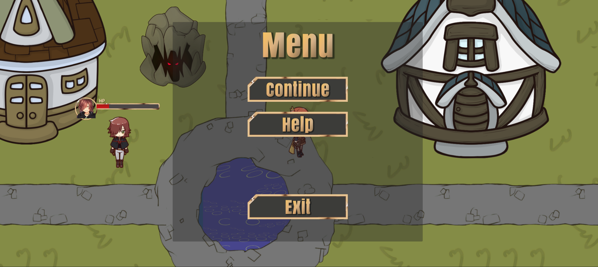

# Enlighter

# Getting Started
Unity Hub

Unity 2022.3.4f1

# Model and Engine
## story map


## engine architecture


# APIs and Controller

### Endpoint
##### `GET /players/{playerId}/cards`

Retrieves the cards held by a specific player.

**Path Parameters**

| Parameter  | Type   | Description                       |
| ---------- | ------ | --------------------------------- |
| `playerId` | string | The unique identifier of a player |

**Response Codes**

| Code                      | Description              |
| ------------------------- | ------------------------ |
| `200 OK`                  | Success                  |
| `400 Bad Request`         | Invalid parameters       |
| `503 Service Unavailable` | Server fails to get data |

**Response**

```json
{
  "playerId": "string",
  "cards": [
    {
      "id": "string",
      "rank": "string",
      "category": "string",
      "visible": boolean,
      "inUse": boolean
    },
    ...
  ]
}
```

- `playerId` (string): The unique identifier of the player.
- `cards `(array): An array of card objects representing the cards held by the player.
  - `id` (string): The unique identifier of the card.
  - `category` (string): The category of the card (e.g., "regular", "profession", "character").
  - `rank` (string): The rank of the card (e.g., "white", "blue", "orange").
  - `visible` (boolean): Indicates whether the card is visible to other players.
  - `inUse`(boolean): Whether the card is in use.

### Endpoint
##### `GET /cards/{cardID}`

Retrieves detailed information about a specific card.

**Path Parameters**

| Parameter | Type   | Description                      |
| --------- | ------ | -------------------------------- |
| `cardId`  | string | The unique identifier of a card. |

**Response Codes**

| Code                      | Description              |
| ------------------------- | ------------------------ |
| `200 OK`                  | Success                  |
| `400 Bad Request`         | Invalid parameters       |
| `503 Service Unavailable` | Server fails to get data |

**Response**

```json
{
  "id": "string",
  "rank": "string",
  "category": "string",
  "visible": boolean,
  "inUse": boolean
}

```

- `playerId` (string): The unique identifier of the player.
- `cards `(array): An array of card objects representing the cards held by the player.
  - `id` (string): The unique identifier of the card.
  - `category` (string): The category of the card (e.g., "regular", "profession", "character").
  - `rank` (string): The rank of the card (e.g., "white", "blue", "orange").
  - `visible` (boolean): Indicates whether the card is visible to other players.
  - `inUse`(boolean): Whether the card is in use.

### Endpoint
##### `POST /players/{playerID}/changes`

Posts changes to a targeted character.

**Path Parameters**

| Parameter  | Type   | Description                          |
| ---------- | ------ | ------------------------------------ |
| `playerID` | string | The unique identifier of the player. |

**Request Body**

```json
{
    "effects":[
    {
        "attribute": "string",
        "magnitude": int,
        "duration": int
    },
    ...
  ]     
}
```

- `effect`(array): indicates the changing effects of the certain player
  - `attribute`: the changing attribute's name
  - `magnitude`: the changing magnitude
  - `duration`: the lasting time of the change. "-1" if permanent

**Response**

```json
{
  "message": "success"
}
```

- `message` (string): A success message indicating that the changes were applied successfully.


**Request Parameters**

### Endpoint: 
##### `GET /get_other_location`

**Request Parameters**

| Key  | Type   | Description        |
| ---- | ------ | ------------------ |
| `id` | string | UUID of the player |

**Response Codes**

| Code                      | Description              |
| ------------------------- | ------------------------ |
| `200 OK`                  | Success                  |
| `400 Bad Request`         | Invalid parameters       |
| `503 Service Unavailable` | Server fails to get data |

**Returns**

| Key         | Type         | Description                      |
| ----------- | ------------ | -------------------------------- |
| `locations` | list of JSON | A list of all players' locations |

Each JSON in `locations` has a structure of:

| Key  | Type   | Description                           |
| ---- | ------ | ------------------------------------- |
| `id` | string | UUID of the player                    |
| `x`  | float  | X coordinate of the player's location |
| `y`  | float  | Y coordinate of the player's location |

### Endpoint: 
##### `POST /update_self_location`

**Request Body**

| Key  | Type   | Description                           |
| ---- | ------ | ------------------------------------- |
| `id` | string | UUID of the player                    |
| `x`  | float  | X coordinate of the player's location |
| `y`  | float  | Y coordinate of the player's location |

**Response Codes**

| Code                      | Description                 |
| ------------------------- | --------------------------- |
| `200 OK`                  | Success                     |
| `400 Bad Request`         | Invalid body or method      |
| `503 Service Unavailable` | Server fails to update data |

**Returns**

If not with HTTP code 200:

| Key      | Type   | Description   |
| -------- | ------ | ------------- |
| `reason` | string | Error message |

### Endpoint: 
##### `GET /get_trading_resource`

**Request Parameters**

| Key  | Type   | Description        |
| ---- | ------ | ------------------ |
| `id` | string | UUID of the player |

**Response Codes**

| Code                      | Description              |
| ------------------------- | ------------------------ |
| `200 OK`                  | Success                  |
| `400 Bad Request`         | Invalid parameters       |
| `503 Service Unavailable` | Server fails to get data |

**Returns**

| Key         | Type         | Description                      |
| ----------- | ------------ | -------------------------------- |
| `resources` | list of JSON | A list of shops' resources/cards |

Each JSON in `resources` has a structure of:
	the same as card 

| Key           | Type   | Description                                                  |
| ------------- | ------ | ------------------------------------------------------------ |
| `id`          | string | identify of the card                                         |
| `rank`        | string | the rank of the card ("white", "blue", or "orange")          |
| `category`    | string | the category of the card ("general", "professional", or "character") |
| `selected`    | bool   | whether the card is bought and locked by other players       |
| `price`       | int    | the price of the card                                        |
| `description` | string | detailed information about a specific card                   |
| `imageurl`    | string | picture url of the card                                      |

### Endpoint: 
##### `POST /buy_cards`

**Request Body**

| Key        | Type   | Description                           |
| ---------- | ------ | ------------------------------------- |
| `playerId` | string | UUID of the player                    |
| `cardId`   | string | identify of the card that user bought |
| `money`    | int    | the amount of money user have         |

**Response Codes**

| Code                      | Description                 |
| ------------------------- | --------------------------- |
| `200 OK`                  | Success                     |
| `400 Bad Request`         | Invalid body or method      |
| `503 Service Unavailable` | Server fails to update data |

**Returns**

If not with HTTP code 200:

| Key      | Type   | Description   |
| -------- | ------ | ------------- |
| `reason` | string | Error message |

### Endpoint
##### `GET /MapStatus`

**Request Parameters**

| Parameter        | Type   | Description                              |
| ---------------- | ------ | ---------------------------------------- |
| `PlayerLocation` | vector | The coordinates of the player's location |

**Response Codes**

| Code                      | Description              |
| ------------------------- | ------------------------ |
| `200 OK`                  | Success                  |
| `400 Bad Request`         | Invalid parameters       |
| `503 Service Unavailable` | Server fails to get data |

**Returns**

| Key   | Type         | Description                                               |
| ----- | ------------ | --------------------------------------------------------- |
| Cards | list of JSON | A list of all cards at a certain distance from the player |

Each JSON in `Cards` has a structure of:

| Key       | Type   | Description                                                  |
| --------- | ------ | ------------------------------------------------------------ |
| id        | string | identify of the card                                         |
| rank      | string | the rank of the card ("white", "blue", or "orange")          |
| category  | string | the category of the card ("general", "professional", or "character") |
| location  | vector | the coordinates of the card                                  |
| usability | bool   | whether the card can be seen and picked up                   |

### Endpoint
##### `POST /UpdateMapStatus`

**Request Body**

| Key       | Type   | Description                                |
| --------- | ------ | ------------------------------------------ |
| id        | string | identify of the card                       |
| location  | vector | the coordinates of the card                |
| usability | bool   | whether the card can be seen and picked up |

**Response Codes**

| Code                      | Description              |
| ------------------------- | ------------------------ |
| `200 OK`                  | Success                  |
| `400 Bad Request`         | Invalid parameters       |
| `503 Service Unavailable` | Server fails to get data |

### Endpoint
##### `GET /MapResources`

Retrieves detailed information about a specific card reached by the player.

**Path Parameters**

| Parameter   | Type | Description                                                  |
| ----------- | ---- | ------------------------------------------------------------ |
| `cardIndex` | int  | The index of the card reached by the player among map resources. |

**Response Codes**

| Code                      | Description              |
| ------------------------- | ------------------------ |
| `200 OK`                  | Success                  |
| `400 Bad Request`         | Invalid parameters       |
| `503 Service Unavailable` | Server fails to get data |

**Response**

```json
{
  "cardIndex": "int",
  "cardInfo": {
      "id": "string",
      "rank": "string",
      "category": "string",
      "visible": boolean,
      ...
    }
}
```

- `cardInfo `(list): An list that shows attributes of the card reached by the player.
  - `id` (string): The unique identifier of the card.
  - `rank` (string): The rank of the card (e.g., "white", "blue", "orange").
  - `category` (string): The category of the card (e.g., "regular", "profession", "character").
  - `visible` (boolean): Indicates whether the card is visible to other players.

### Endpoint
##### `GET /players/{playerId}/CharacterStatus`

**Path Parameters**

| Parameter  | Type   | Description                       |
| ---------- | ------ | --------------------------------- |
| `playerId` | string | The unique identifier of a player |

**Response Codes**

| Code                      | Description              |
| ------------------------- | ------------------------ |
| `200 OK`                  | Success                  |
| `400 Bad Request`         | Invalid parameters       |
| `503 Service Unavailable` | Server fails to get data |

**Response**

```json
{
  "playerId": "string",
  "characterStatus": {
      "role": "string",
      "health": "int",
      "shield": "int",
      "cardsNum": "int",
      "speed": "float",
      "visible": boolean,
      ...
    },
}
```

- `playerId` (string): The unique identifier of the player.
- `characterStatus `(list): An list of attributes representing the status of the requested player.
  - `role` (string): The role of the player.
  - `health` (int): The HP of the player.
  - `shield` (int): The shield of the player.
  - `cardsNum` (int): The number of cards that the player have.
  - `speed` (float): The speed of the player.
  - `visible` (boolean): Indicates whether the card is visible to other players.

## Third-Party SDKs

None

# View UI/UX

### Main Menu
Play button is the entry for players who want to start a new game. Tutorial button is designed for beginners as guidance.

Host a game or join a game.


### Tutorial
First choose your character.

Then move around by dragging the joystick.

Resourses on the map can be picked up, which usually represents a card.

Attack the enemy using cards.

Kill the enemy and pick up loot.

Attacked by enemy.

If there is any questions regarding the interface, press menu button and look for help.


Move to another region and kill the last enemy.

Win the game and reach to the result page of the game.


# Team Roster

| Name        | GitHub Username                             | Design            | Programming |
| ----------- | ------------------------------------------- | ----------------- | ----------- |
| Qi Lei      | [LeiQi7](https://github.com/LeiQi7)         | System Design     | Front end   |
| Lan Wang    | [yexiaosu](https://github.com/yexiaosu)     | Role Design       | Back end    |
| Zefang Wei  | [mraf2019](https://github.com/mraf2019)     | Background Design | Front end   |
| Yiwei Zhang | [Sunnyvale7](https://github.com/Sunnyvale7) | Role Design       | Back end    |
| Siyi Qian   | [Kikaze-K](https://github.com/Kikaze-K)     | Card & Map Design | Back end    |
| Wanying Ji  |                                             | Card & Map Design | Front end   |

# Contributions

Here lists contributors and their work till 7/18:

<a href="https://github.com/mraf2019/Wanderers/graphs/contributors">
  
</a>

Made with [contrib.rocks](https://contrib.rocks).

## Overview

https://github.com/mraf2019/Wanderers/graphs/contributors

## Lan Wang (yexiaosu)

contributions placeholder

## Siyi Qian (Kikaze-K)

enemy model and walking animation, minimap, camera motion update  (y-axis depth of field), result page, collect loot, step-by-step tutorial guidance

## Qi Lei (LeiQi7)

contributions placeholder

## Yiwei Zhang (Sunnyvale7)

contributions placeholder

## Zefang Wei (mraf2019)

contributions placeholder

## Wanying Ji ()

contributions placeholder
